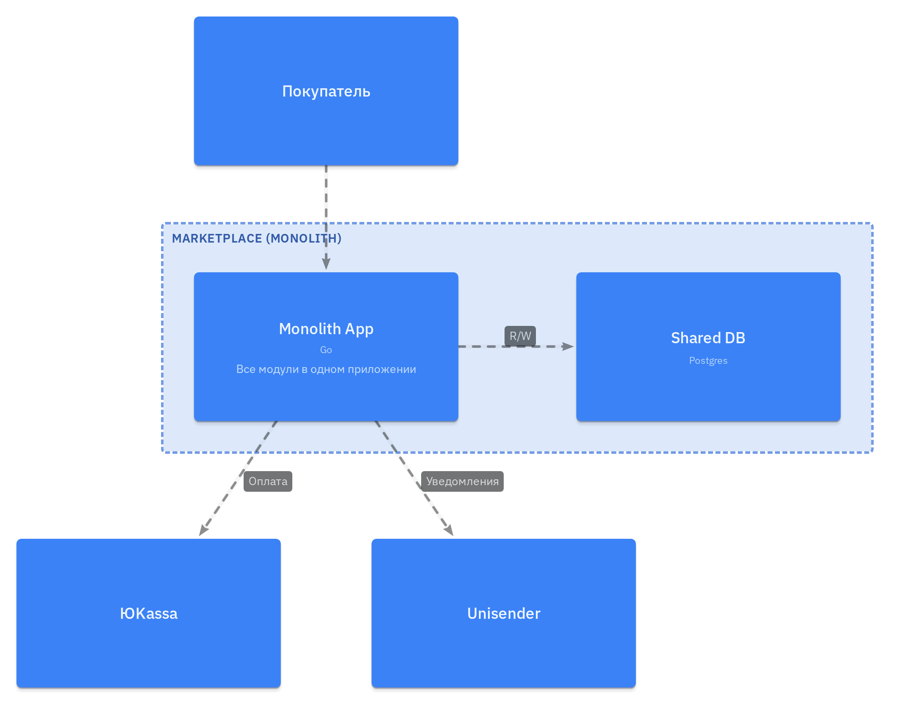
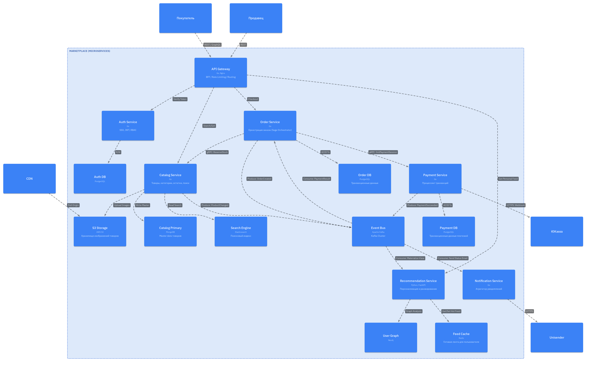

# Архитектура

## Предметная область и Домены

На основе требований были выделены следующие ключевые домены. Каждый домен изолирует специфическую бизнес-логику.

| Домен | Ответственность | Ключевые сущности |
| :--- | :--- | :--- |
| Каталог | Управление товарным ассортиментом, категоризация, фасетный поиск, хранение медиа-контента. | Товар, Категория, Атрибут, Характеристика |
| Пользователи | Идентификация, аутентификация, управление профилями покупателей и продавцов, безопасность. | Пользователь, Роль (Buyer/Seller), Сессия, Токен |
| Заказы | Жизненный цикл заказа от "Корзины" до "Доставлено". Валидация стоков, история покупок. | Корзина, Заказ, Позиция заказа, Статус |
| Платежи | Финансовые транзакции, интеграция с платежными шлюзами, фискализация, возвраты. | Транзакция, Счет, Чек, Платежный метод |
| Персонализация | Анализ поведения пользователей, формирование персональной выдачи (ML), ранжирование товаров. | Профиль предпочтений, Граф интересов, Лента |
| Коммуникации | Транспортный уровень для доставки сообщений пользователям по почте. | Уведомление, Шаблон |

## Декомпозиция сервисов и Владение данными

Архитектура построена на паттерне микросервисов, у каждого сервиса своя база данных. Это исключает наличие разделяемых баз данных и жесткую связность.

### Распределение ответственности

#### 1. Auth Service
- Язык: Go
- Данные: `AuthDB` (PostgreSQL). Хранит хеши паролей, users, roles.
- Ответственность: Выдача JWT токенов, регистрация, валидация прав доступа.
- Взаимодействие: Синхронное (gRPC) для проверки токенов API Gateway-ем.

#### 2. Catalog Service
- Язык: Go
- Данные:
    - `CatalogDB` (MongoDB): Выбрана Document-oriented БД, так как товары имеют разный набор атрибутов (JSON-структуру), который сложно уложить в жесткие SQL-таблицы.
    - `SearchEngine` (Elasticsearch): Поисковый индекс для быстрого нечеткого поиска.
- Ответственность: Управление товарами, категориями.
- Взаимодействие: Отдает данные по gRPC. Публикует события `ProductChanged` в Kafka для индексации и обновления кэшей.

#### 3. Order Service
- Язык: Go
- Данные: `OrderDB` (PostgreSQL). Реляционная БД для обеспечения ACID-транзакций при оформлении заказа.
- Ответственность: Создание заказа, резервирование (через вызов Catalog), управление статусами.
- Взаимодействие: Оркестрирует процесс покупки. При смене статуса публикует событие `OrderCreated` в Kafka.

#### 4. Payment Service
- Язык: Go
- Данные: `PaymentDB` (PostgreSQL).
- Ответственность: Взаимодействие с внешним шлюзом (ЮKassa).
- Взаимодействие: Асинхронно уведомляет Order Service об успехе оплаты через Kafka (`PaymentSucceeded`).

#### 5. Recommendation Service
- Язык: Python (FastAPI + ML libs)
- Данные:
    - `RecoGraph` (Neo4j): Хранение графа "User -> Click -> Item". Графовая БД позволяет строить рекомендации на основе связей между пользователями и товарами.
    - `FeedCache` (Redis): Кэш готовой ленты товаров.
- Ответственность: Обучение модели, генерация списка `product_id` для пользователя.
- Взаимодействие: Инференс ML-модели - тяжелая операция, нельзя пересчитывать рекомендации при каждом открытии страницы. Поэтому сервис работает в фоне: слушает Kafka (покупки/просмотры), пересчитывает граф и кладет готовые ID в Redis. API Gateway просто забирает данные из Redis.

#### 6. Notification Service
- Язык: Go
- Данные: Stateless
- Ответственность: Агрегация событий из Kafka (OrderCreated, OrderShipped, PaymentSucceeded) и отправка email через Unisender. Использует шаблоны для разных типов уведомлений.
- Взаимодействие: Асинхронно слушает Kafka, при получении события отправляет уведомление пользователю.

## Сравнение архитектурных решений

Для выбора финальной архитектуры были рассмотрены два варианта.

### Вариант 1: Модульный Монолит (Modular Monolith)

Единое приложение, где домены разделены на уровне модулей кода, использующее одну базу данных (или логически разделенные схемы).

| Плюсы | Минусы |
| :--- | :--- |
| Простота старта: Легче писать, дебажить и деплоить на раннем этапе (один артефакт). | Сложность масштабирования: Нельзя масштабировать только модуль "Каталог" при наплыве трафика, нужно скейлить весь монолит. |
| ACID транзакции: Проще поддерживать целостность данных (в рамках одной БД). | Единый стек: Невозможно писать ML-модуль на Python, а ядро на Go в рамках одного процесса. |
| Цена: Дешевле инфраструктура (меньше накладных расходов на сеть и оркестрацию). | Отказоустойчивость: Утечка памяти в одном модуле может полложить весь маркетплейс. |

### Вариант 2: Микросервисы (Выбранный вариант)

Система распределенных сервисов, взаимодействующих по сети.

| Плюсы | Минусы |
| :--- | :--- |
| Heterogeneous Stack: Позволяет использовать Go для HighLoad (Order/Catalog) и Python для ML (Recommendations). | Сложность инфраструктуры: Требует настройки Docker, Kafka |
| Независимое масштабирование: Можно поднять 50 инстансов Каталога и 2 инстанса Оплат. | Сетевые задержки: Взаимодействие по сети медленнее, чем вызов функции внутри процесса. |
| Изоляция сбоев: Падение сервиса рекомендаций не остановит продажи (просто пропадет персонализация). |

## Обоснование финального выбора

Для реализации Маркетплейса выбрана микросервисная архитектура по следующим причинам:

1.  Требование персонализации (ML): Для качественных рекомендаций необходим Python, для высоконагруженного процессинга заказов и каталога оптимален Go. Микросервисы позволяют объединить эти технологии.
2.  Разный профиль нагрузки на разные сервисы:
    - Каталог: Read-heavy (тысячи запросов на чтение). Требует кэширования и масштабирования реплик.
    - Заказы/Платежи: Write-critical. Требуют строгой консистентности.
    Разделение позволяет оптимизировать ресурсы (CPU/Memory) под конкретную задачу.
3.  Отказоустойчивость: Микросервисы позволяют системе деградировать частично (если сломался поиск, можно зайти в категорию; если сломались рекомендации, показываются популярные товары), сохраняя главную функцию - возможность купить товар.
